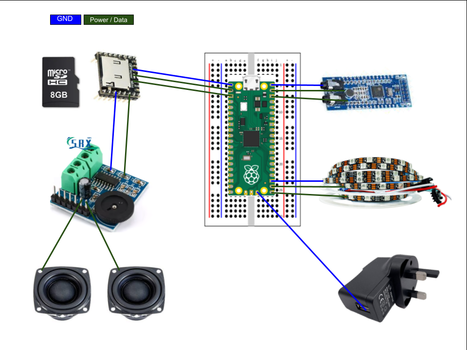

# 🎄 Gethin's Voice-Controlled Christmas Lights v1

This repository contains all design files for my **HackClub Blueprint Custom LED Project**.  
My project is designed to combine **voice recognition**, **LED strip lights**, and **christmas music playback** for a cool interactive christmas setup that controls LED strip lights & plays songs via a DFPlayer mini MP3 player.

 

**It should feature:**

-Raspberry Pi Pico

-LD3320 voice recoginition module

-WS2812B LED strip lights (30 led/m - 2m)

-DFPlayer Mini & 8gb microSD storage

-PAM8403 amplifier & 3W speakers

-5V 3A wall power adapter

-Breaboard & jumper wires

-Barrel jack breakout board

-Speaker extension wire (if needed)

---

## Rough layout

## 📸 My view for the project

-I want the Raspberry Pi Pico to listen for voice commands through the LD3320 voice recognition module.

-The user can use prompts to control the setup.

-Triggers colorful LED animations on the WS2812B strip lights & plays christmas songs through the DFPlayer Mini

## Firmware Summary

The firmware is written in CircuitPython and split into small modules that handle LEDs, audio, and voice input seperately and then are referenced in the difference codes.
Main.py ties everything together by listening for voice triggers, running LED effects, and playing songs from the DFPlayer.
I will easily change the code later by editing the individual helper codes.

## Audio Summary

Music is stored on the DFPlayer Mini’s microSD card and are numbered as 0001.mp3.
The Pico sends simple commands to play tracks, while a PAM8403 amp and BF-37 speakers provide the audio output and play the christmas songs when commanded.

## 🔌 Breadboard design

**Rough idea for connections:**

-WS2812B - Pico GP0 -> LED DI

-DFPlayer - Pico GP8 -> DFPlayer RX, GP9 (RX) -> DFPlayer TX

-LD3320 (SPIO):
   GP2 -> SCK
   GP3 -> MOSI
   GP4 -> MISO
   GP5 -> CS
   GP6 -> RST
   #maybe GP7 -> IRQ (interupt)
   
-PAM8403 -> 3W speakers

-Shared 5V & GND rails

---
## Power
I am going to use one 5V 3A adapter to power the LED strips, the PAM8403 amplifier, the DFPlayer mini & my pico (through VSYS)
The LD3320 voice recognition will use 3.3V from my pico and all the grounds will be shared so the devices don't get mixed up with 0V

⚠️ I'm gonna make sure the LED is powered from the 5V 3A adapter and not from the Pico and that all data connections come from the pico GPIO pins, not the breadboard

---
## Voice commands

I will add many voice commands that users can use to control the lights & sounds.

**A few will include:**

-"**red**" - **makes lights glow red and turn on and off**

-"**green**" - **makes lights glow green and turn on and off**

-"**random song**" - **the DFPlayer will select & play a random christmas song**

-"**song1**" - **DFPlayer will play first song in album**

-"**song2**" - **DFPlayer will play second song in album**

-"**dark**" - **lights will turn off**

-"**stop**" - **DFPlayer will stop playback & wait for another command**

-"**turn off**" - **Pico will stop music, lights & voice recoginiton - essentially neutral mode**

---

## Bill of Materials (BOM)

| Component                | Notes                                                       | Links |
|--------------------------|-------------------------------------------------------------|-------|
| Raspberry Pi Pico        | Normal Pico                                       | [AliExpress](https://www.aliexpress.com/item/1005006087823796.html?spm=a2g0o.productlist.main.2.6038bnL1bnL1Dn&aem_p4p_detail=20251212000426218786655824620000048793&algo_pvid=92a02965-7ab1-470a-8c57-360433b21389&algo_exp_id=92a02965-7ab1-470a-8c57-360433b21389-1&pdp_ext_f=%7B%22order%22%3A%221068%22%2C%22eval%22%3A%221%22%2C%22fromPage%22%3A%22search%22%7D&pdp_npi=6%40dis%21GBP%212.52%210.76%21%21%2123.11%216.97%21%4021038df617655266661734853efbe3%2112000044713099471%21sea%21UK%210%21ABX%211%210%21n_tag%3A-29910%3Bd%3Afc98b1ba%3Bm03_new_user%3A-29895%3BpisId%3A5000000187461876&curPageLogUid=gTAYTqJqOru1&utparam-url=scene%3Asearch%7Cquery_from%3A%7Cx_object_id%3A1005006087823796%7C_p_origin_prod%3A&search_p4p_id=20251212000426218786655824620000048793_1)    |
| LD3320 Voice Module      | Offline voice recognition - STC11S                          | [AliExpress](https://www.aliexpress.com/item/1005007144572665.html?gatewayAdapt=usa2glo4itemAdapt)    |
| WS2812B LED Strip        | 2 m, 30 LEDs/m                                 | [AliExpress](https://www.aliexpress.com/item/1005009580843710.html?spm=a2g0o.productlist.main.1.2cb6mcC0mcC0uM&algo_pvid=d9cceaaa-2c2b-4222-b4f4-6c0cafd99f8c&algo_exp_id=d9cceaaa-2c2b-4222-b4f4-6c0cafd99f8c-0&pdp_ext_f=%7B%22order%22%3A%222151%22%2C%22eval%22%3A%221%22%2C%22fromPage%22%3A%22search%22%7D&pdp_npi=6%40dis%21GBP%216.03%211.64%21%21%2155.26%2115.00%21%40210385bb17655267615017494e8832%2112000049538590309%21sea%21UK%210%21ABX%211%210%21n_tag%3A-29910%3Bd%3Afc98b1ba%3Bm03_new_user%3A-29895%3BpisId%3A5000000187461876&curPageLogUid=T6KvRucfpCLh&utparam-url=scene%3Asearch%7Cquery_from%3A%7Cx_object_id%3A1005009580843710%7C_p_origin_prod%3A)   |
| DFPlayer Mini            | MP3 playback                                        | [AliExpress](https://www.aliexpress.com/item/1005006166800318.html?spm=a2g0o.productlist.main.1.764a21Fc21FcMB&algo_pvid=bc4a30aa-3f83-437a-9627-fddc84290746&algo_exp_id=bc4a30aa-3f83-437a-9627-fddc84290746-0&pdp_ext_f=%7B%22order%22%3A%22576%22%2C%22eval%22%3A%221%22%2C%22fromPage%22%3A%22search%22%7D&pdp_npi=6%40dis%21GBP%211.14%210.76%21%21%2110.43%216.95%21%40211b819117652667080666710e5ece%2112000037327793485%21sea%21UK%216897923402%21ABX%211%210%21n_tag%3A-29910%3Bd%3Ae5f61ebb%3Bm03_new_user%3A-29895%3BpisId%3A5000000187461875&curPageLogUid=mRzHM7pNTvL9&utparam-url=scene%3Asearch%7Cquery_from%3A%7Cx_object_id%3A1005006166800318%7C_p_origin_prod%3A)     |
| MicroSD Card (8–16 GB)   | FAT32 formatted                                   | [AliExpress](https://www.aliexpress.com/item/1005006144552741.html?spm=a2g0o.productlist.main.16.611d1683CREpQN&algo_pvid=a4e89a77-d5c0-4a18-9ddb-23e2583ae3bc&algo_exp_id=a4e89a77-d5c0-4a18-9ddb-23e2583ae3bc-15&pdp_ext_f=%7B%22order%22%3A%221318%22%2C%22eval%22%3A%221%22%2C%22fromPage%22%3A%22search%22%7D&pdp_npi=6%40dis%21GBP%213.22%210.76%21%21%214.19%210.99%21%40210384cc17655268019752896e8609%2112000035960649817%21sea%21UK%210%21ABX%211%210%21n_tag%3A-29910%3Bd%3Afc98b1ba%3Bm03_new_user%3A-29895%3BpisId%3A5000000187461876&curPageLogUid=rGDfI39uemWm&utparam-url=scene%3Asearch%7Cquery_from%3A%7Cx_object_id%3A1005006144552741%7C_p_origin_prod%3A)     |
| PAM8403 Amplifier Board  | Stereo 5 V amp, version with knob                  | [AliExpress](https://www.aliexpress.com/item/1005008464498399.html?spm=a2g0o.productlist.main.26.7a5f7b6a5GCmmM&algo_pvid=f1352bee-eaa7-481e-88f5-b01d98d338ac&algo_exp_id=f1352bee-eaa7-481e-88f5-b01d98d338ac-25&pdp_ext_f=%7B%22order%22%3A%2215%22%2C%22eval%22%3A%221%22%2C%22fromPage%22%3A%22search%22%7D&pdp_npi=6%40dis%21GBP%211.02%210.98%21%21%211.32%211.27%21%402103864c17655268608935749e5252%2112000045247471743%21sea%21UK%210%21ABX%211%210%21n_tag%3A-29910%3Bd%3Afc98b1ba%3Bm03_new_user%3A-29895&curPageLogUid=mcSPYSBJFHhs&utparam-url=scene%3Asearch%7Cquery_from%3A%7Cx_object_id%3A1005008464498399%7C_p_origin_prod%3A)   |
| 3W Speakers (pair)       | Small drivers speakers                                      |  [AliExpress](https://www.aliexpress.com/ssr/300000512/BundleDeals2?spm=a2g0o.productlist.main.5.20f0f9c6AMCWIo&productIds=1005008326457654:12000044613535197&pha_manifest=ssr&_immersiveMode=true&disableNav=YES&sourceName=SEARCHProduct&utparam-url=scene%3Asearch%7Cquery_from%3A%7Cx_object_id%3A1005008326457654%7C_p_origin_prod%3A&pvid=1a93dce1-9725-416a-ae8f-d39460055ef7)     |
| 5 V 3 A Wall Adapter     | Power supply     |   [AliExpress](https://www.aliexpress.com/item/1005006641396516.html?spm=a2g0o.productlist.main.4.4cb9673a7mEpW1&algo_pvid=25d8e566-c4b3-409a-b236-8db70d315c35&algo_exp_id=25d8e566-c4b3-409a-b236-8db70d315c35-3&pdp_ext_f=%7B%22order%22%3A%22329%22%2C%22eval%22%3A%221%22%2C%22fromPage%22%3A%22search%22%7D&pdp_npi=6%40dis%21GBP%213.71%210.76%21%21%2133.98%216.92%21%4021038e1e17655582284887798ebb63%2112000037902990332%21sea%21UK%210%21ABX%211%210%21n_tag%3A-29910%3Bd%3Afc98b1ba%3Bm03_new_user%3A-29895%3BpisId%3A5000000187461877&curPageLogUid=PRV8YTcqXw5T&utparam-url=scene%3Asearch%7Cquery_from%3A%7Cx_object_id%3A1005006641396516%7C_p_origin_prod%3A)    |
| Breadboard               | For prototyping   | [AliExpress bundle](https://www.aliexpress.com/ssr/300000512/BundleDeals2?spm=a2g0o.productlist.main.1.692d1e60ffPnyJ&productIds=1005008787753880:12000046666091866&pha_manifest=ssr&_immersiveMode=true&disableNav=YES&sourceName=SEARCHProduct&utparam-url=scene%3Asearch%7Cquery_from%3A%7Cx_object_id%3A1005008787753880%7C_p_origin_prod%3A&pvid=7089a907-456f-4404-a7fe-0a8ddeeaab37)       |
| Jumper Wires             | Male–male/female, assorted lengths        | [AliExpress](https://www.aliexpress.com/item/1005006616309305.html?spm=a2g0o.productlist.main.2.1d147c1aVGHwf7&aem_p4p_detail=202512120011083409994903434200000040416&algo_pvid=6c592fd7-6e04-41c8-a406-357a2a9e3593&algo_exp_id=6c592fd7-6e04-41c8-a406-357a2a9e3593-1&pdp_ext_f=%7B%22order%22%3A%22436%22%2C%22eval%22%3A%221%22%2C%22fromPage%22%3A%22search%22%7D&pdp_npi=6%40dis%21GBP%210.91%210.76%21%21%211.18%210.98%21%40211b81a317655270684283141e39b8%2112000037832224162%21sea%21UK%210%21ABX%211%210%21n_tag%3A-29910%3Bd%3Afc98b1ba%3Bm03_new_user%3A-29895%3BpisId%3A5000000187461875&curPageLogUid=2ymewYtw1y88&utparam-url=scene%3Asearch%7Cquery_from%3A%7Cx_object_id%3A1005006616309305%7C_p_origin_prod%3A&search_p4p_id=202512120011083409994903434200000040416_1)     |
| Speaker Wire (20–22 AWG) | Twisted pairs, ~1–2 m runs                       |[don't think i need]      |
| Barrel jack breakout board | To take power from the wall adapter | [link] |

I have sourced most of my components from AliExpress to lower the cost and the use of the grant
---

## 🚀 Next Steps

- Once my project is approved, I will use the grant to purchase the components from the links in my BOM
- I will build the breadboard prototype with all modules connected
- I will test the LED animations and confirm that the DFPlayer plays music correctly
- I will train the LD3320 with my voice commands
- I will update this README & my project on Blueprints with photos & videos of the setup fully functional

---

## Firmware Instructions

1. Flash the Raspberry Pi Pico 2 WH with MicroPython firmware.  
2. Connect via USB and upload `main.py`.  
3. Install required libraries:
   - `neopixel` for WS2812B LED control
   - UART driver for DFPlayer Mini
   - LD3320 driver (custom integration)
4. Train LD3320 with chosen voice commands (e.g., "lights on", "play music").  
5. Test LEDs and music playback.

---

## 📝 License
This project is open-source under the MIT License and created by @Gethin101
